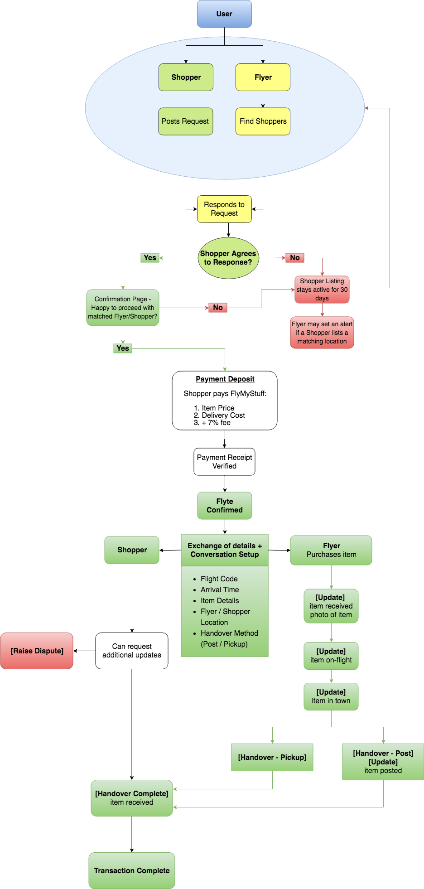
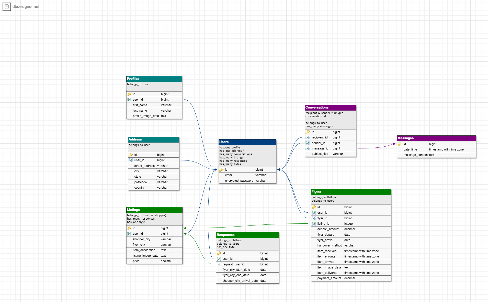
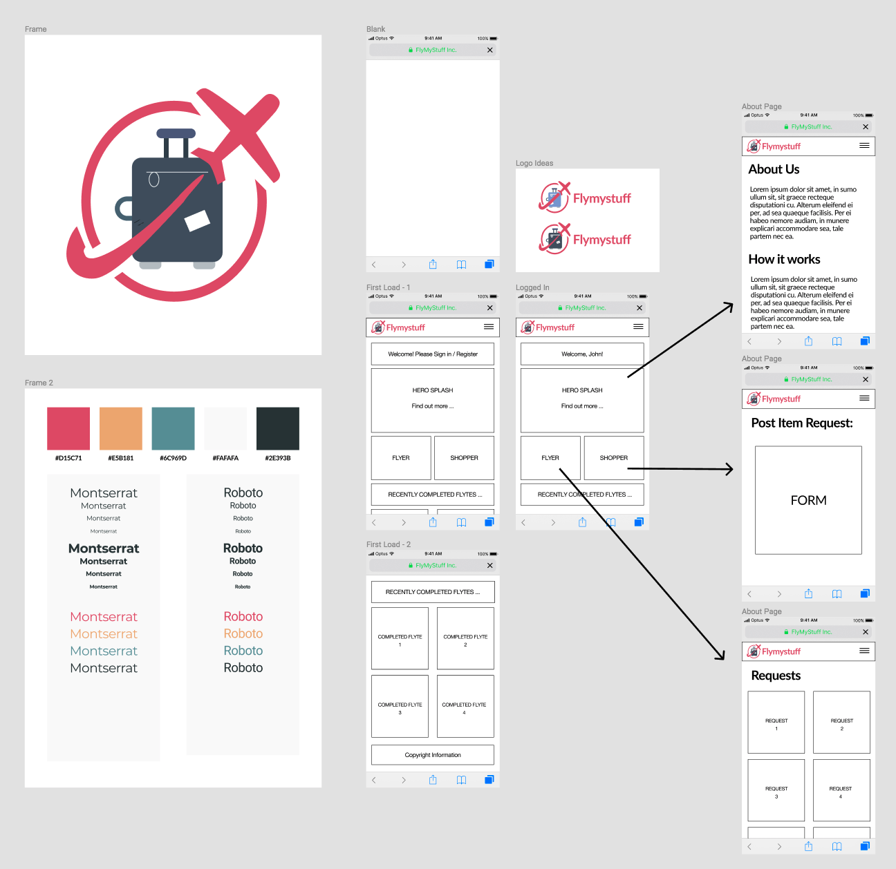

# FlyMyStuff Rails Project
flymystuff.herokuapp.com
## Introduction
FlyMyStuff is a global network connecting international Shoppers with Flyers who have baggage space to spare.

Quite often, people who have travelled overseas and returned, find themselves craving for more of a favourite item or items that they have bought at a store but have been unable to find online stores that can ship the item over to them, or the postage costs outweight the benefits, or the postage takes far too long to reach them and could be lost. 

Flymystuff offers a way for these **Shoppers** to connect with **Flyers** who will be travelling to their place of interest and returning to the **Shopper's** location. 

### How it works
1. **Shoppers** post a 'Flyte' listing for an item at a location they wish to acquire, with the price that they are willing to pay for the item (price should include: price of item, and the delivery tip) and a preferred date they would like to receive the item.
2. A **Flyer** can then accept the *Flyte* and once matched, the **Shopper** is automatically charged a 7% fee of the price they listed for the *Flyte*. No payment is made to the **Flyer** at this stage.
3. The **Flyer** must then provide details of when they are:
    * leaving their overseas location
    * arriving at the **Shopper's** location
3. The **Flyer** is then responsible for purchasing the item in the overseas location and bringing it back with them to the **Shopper's** location. Through the app, the **Flyer** provides regular updates of the item's transit status.
4. The **Flyer** and **Shopper** then agree on how the item is to be handed over once the **Flyer** is in town (Postage / Pickup).
5. Once the item has exchanged hands and the **Shopper** is satisfied, the **Shopper** marks the *Flyte* as complete, and the **Flyer** automatically gets paid.

## Planning
My inspiration for FlyMyStuff stems from my experience as a migrant from Singapore

## Technologies
* **Development Framework:** Ruby on Rails
    * Rspec (testing)
    * Devise (user authentication)
    * Mailgun (mailer functions)
    * Paperclip (file processing)
    * ImageMagick (image processing)
    * Stripe (payment processing)
* **Database:** PostgreSQL
* **Version Control:** Git
* **Deployment:** Heroku
* **File Storage:** AWS S3
### Additional Tools
* Kanban Board (User Stories) Tracking - [Trello](https://trello.com/) 
* Task Timing - [PomoDoneApp](pomodoneapp.com)
* User Journeys - [Draw.io](https://www.draw.io)
* Database Design - [DB Designer](dbdesigner.net)
* Wireframing/UI - [Figma](figma.com)
    * iOS Frame - [iOS Design Kit](https://iosdesignkit.io/ios-11-gui/)
### User Stories, User Journey

I followed some principles outlined in a Screenful blog post "[Tracking user stories with Trello](https://screenful.com/blog/tracking-user-stories-with-trello)", as I wanted to design features from the perspective and needs of end-users.
User Journeys were mapped out using [draw.io](https://www.draw.io). I initially created an overall diagram depicting the macro-level of how a transaction would occur between a "Shopper" user and a "Flyer" user.
I then went on to draw detailed diagrams of each user's perspective of the system.

### Entity-Relationship Diagram (Database Schema)

### Wireframing & Basic UI

#### CSS Inspirations
* [Navbar](https://codepen.io/matthew-tanner/pen/rvOxEB)
* [Landing Page Grid](https://codepen.io/zayncollege/pen/rpWrpP)
* [Cards](https://codepen.io/cssgirl/pen/NGKgrM)

## Rails Programming
### Considerations
* Each user has one profile and for MVP purposes, one address only
    * can be expanded to > 1 address to facilitate postage to addresses other than personal address
* Address currently validates for "State" to be filled -- does not work for countries that do not have states/regions/provinces
